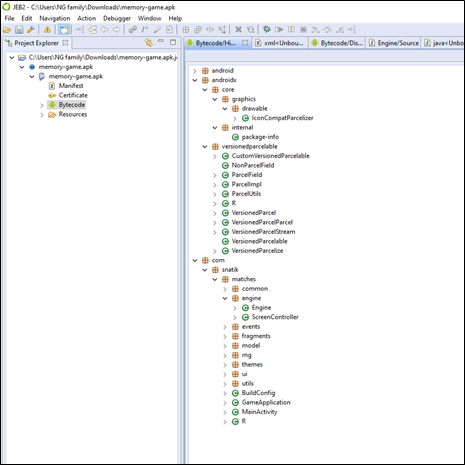
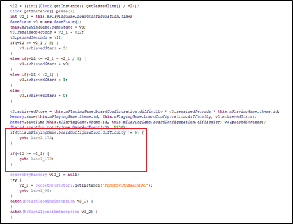
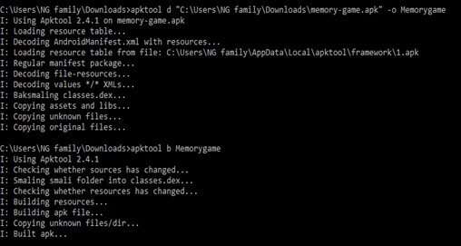
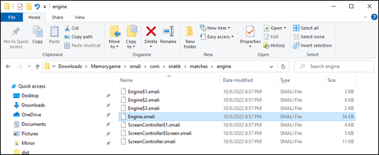
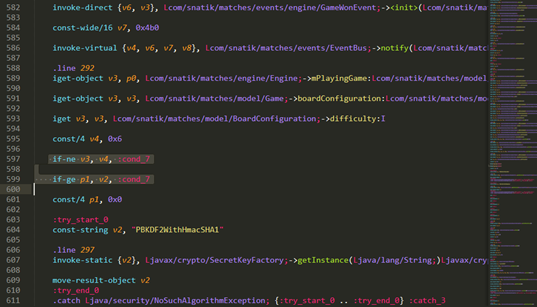
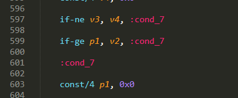
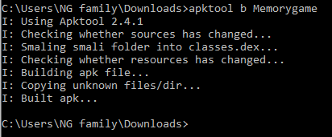
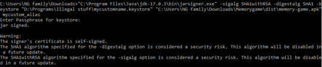
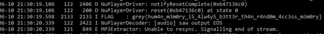

# Memory Game 2
## Static analysis

First step is to perform static analysis to find the function that is handling the criteria check for displaying the flag. I used JEB to perform static analysis on the APK.

Since the challenge stated we had to finish the game in master difficulty in 20 seconds to get the flag. I went to search for the game engine to try to find the check for it. After digging around for a bit I found the check in the engine package in a function called onEvent().

We can see it checks if the difficulty is 6 and if the time used is more than the required time. If the requirements don’t match it jumps pass the flag decrypting. So the next step is to bypass or remove the check.

## Editting the smali

The idea I had was to edit the smali code directly, but I had to check if the APK could be decompiled and recompiled. So using apk tool I checked if the apk could be decompiled and recompiled back.

Success in recompiling. Time to edit the smali source directly. From the static analysis we know that the function is in the com.snatik.matches.engine package so we search for the smali file in the decompiled folder.

Found the 2 lines of check in the smali code and either removed them or shift the condition jump. For the ss below i shifted the condition jump.

After I editted, it looks like this.

Save and recompile back the apk

Before we install the apk into an android emulator to run it we must first sign the apk. Learn how to generate a key and sign an apk [here](https://stackoverflow.com/questions/10930331/how-to-sign-an-already-compiled-apk).    Sign the apk.

## Running the editted APK

Since the challenge stated that the flag will be outputted from logcat. I used Memu emulator with android debug bridge (ADB) attached.

Play the game on the easiest difficulty. Get the flag from log cat. 

